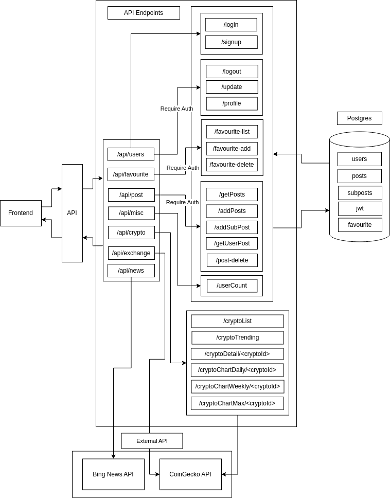
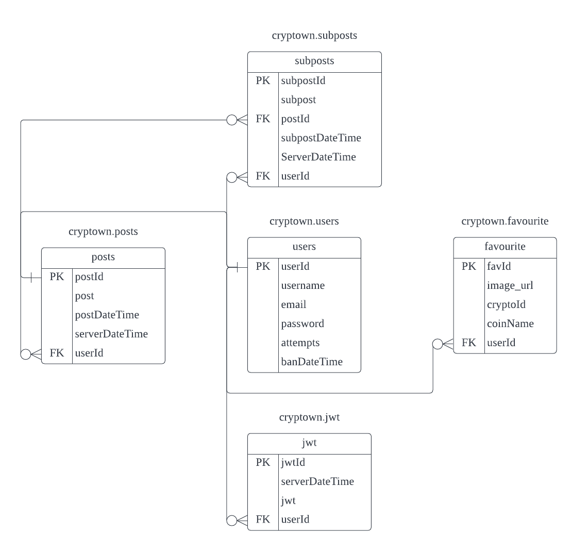
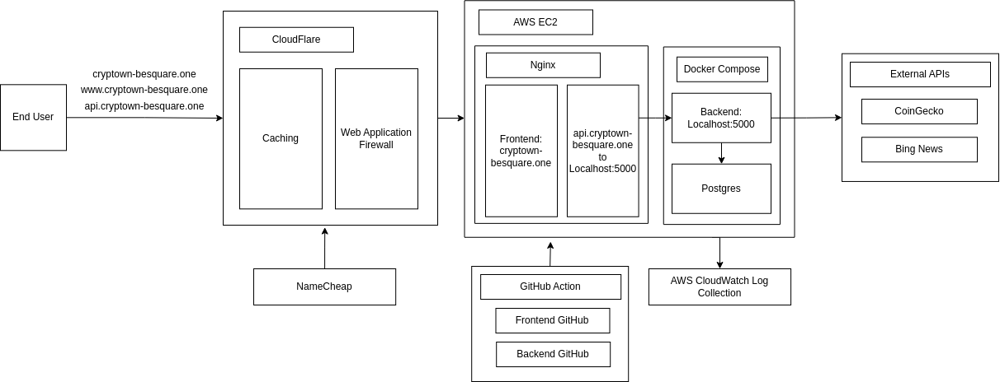

# Cryptown
## Setups
1. Create a ".env" file in the project's root directory
    ```
        PORT=5000
        POSTGRES_PASS='ChangeThis'
        POSTGRES_USER='ChangeThis'
        POSTGRES_DB='ChangeThis'
        POSTGRES_PORT='5432'
        BING_NEWS_TOKEN='ChangeThis'
        AES_PASS='ChangeThis'
    ```
2. Start up dockers by running the following commands in the project's root directory
    ```
        # docker compose --env-file .env up --build
    ```
### Docker Commands 
```
    # docker compose --env-file .env up --build   // use to start the dockers
    # docker compose down          // use to stop the dockers 
    # docker ps         // use to get active docker name
    # docker exec -it \<docker name\> sh    // use to access docker shell 
```

# Backend 
## Architecture 
  

## ERD Diagram
  

# DevOps
Tools  and Services:
 - DNS registrar: NameCheap
 - DNS Nameserver: Cloudflare 
 - Docker/Docker Compose 
 - Nginx
 - AWS EC2
 - AWS CloudWatch 
 - GitHub Action 
 - Cloudflare WAF
 - Cloudflare Caching 
 - Cloudflare SSL/TLS
 - Cloudflare Page Rules

  
